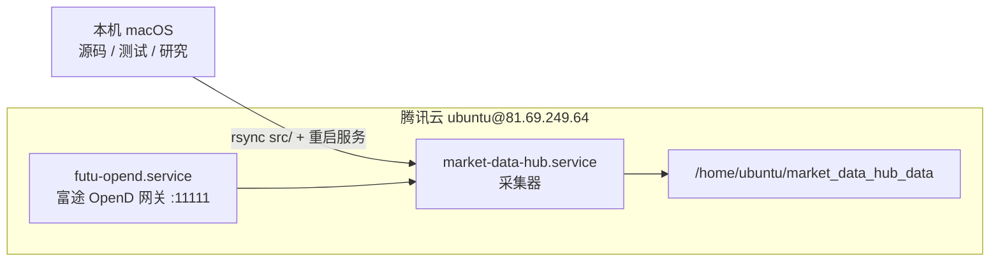

# market_data_hub 开发约束

- 始终使用中文与用户、日志、代码注释和文档交互。
- 使用 `logging`，禁止提交直接写标准输出的调试语句。
- 日志至少包含时间、级别、文件、行号和标的/采集批次等上下文；异常必须记录完整栈。
- 本项目只读采集行情，禁止引入富途交易上下文、账户、持仓、模拟盘或下单 API。
- 修改代码必须同步修改测试，并运行相关 pytest。
- 数据文件在仓库外，通过 manifest 和 SHA256 管理，不把期权行情提交到 Git。

# 部署

**本仓库是源码，本地不部署、不常驻运行实时采集；采集只跑在腾讯云服务器上。**
本机（macOS）只用于开发、跑测试和读历史数据研究，不要在本机启动 `market-data options run`。



## 服务器上的位置

| 内容 | 路径 |
|---|---|
| 代码（editable 安装） | `/opt/market_data_hub/`，虚拟环境 `/opt/market_data_hub/.venv/` |
| 采集配置 | `/opt/market_data_hub/configs/options.yaml` |
| 数据目录 | `/home/ubuntu/market_data_hub_data/`（`raw/` `curated/` `manifests/` `state/` `logs/`） |
| 富途 OpenD | `/opt/futu_opend/`，启动参数 `-login_by_remember=1`（免交互登录） |
| systemd 单元 | `/etc/systemd/system/futu-opend.service`、`market-data-hub.service` |
| 运维脚本 | `/home/ubuntu/bin/verify_raw_vs_curated.py`、`cleanup_opend_logs.sh` |

## 部署流程

```bash
rsync -az --exclude='__pycache__' -e ssh src/market_data_hub/ \
  ubuntu@81.69.249.64:/opt/market_data_hub/src/market_data_hub/
ssh ubuntu@81.69.249.64 'sudo systemctl restart market-data-hub'
```

- 服务器是 **editable 安装**（`.venv` 指向 `/opt/market_data_hub/src`），推完源码重启即可生效，不需要重新 `pip install`。
- **配置在进程启动时一次性读入内存**，改 `options.yaml` 必须重启 `market-data-hub` 才生效。
- 只重启 `market-data-hub`；**不要重启 `futu-opend`**，那会触发 OpenD 重新登录，有风控和互踢行情权限的风险。
- 数据目录由 systemd 单元的 `MARKET_DATA_HUB_DATA_DIR` 注入。

## 部署后验证

```bash
ssh ubuntu@81.69.249.64 '
  systemctl is-active futu-opend market-data-hub
  python3 -m json.tool /home/ubuntu/market_data_hub_data/state/status.json
  df -h /dev/vda2'
```

- `state/status.json` 应为 `running`；出现 `degraded` 就要查日志。
- 采集日志只写文件，终端不打印：`/home/ubuntu/market_data_hub_data/logs/collector.log`（50MB×4 轮转）。`doctor`、`options status` 这类 CLI 的输出也在这个文件里。

## 运维注意

- **磁盘**：`raw_days=1` + `trash_days=1`，Raw 与 trash 合计约 2 天数据；curated 长期累积（约 190MB/交易日）。剩余低于 30GB 告警，低于 10GB 自动暂停采集。
- **句柄**：长跑进程持有已删除文件的句柄会让磁盘空间永远无法回收。曾经因为 `RawSqliteStore` 只在进程退出时才关闭连接，连续 9 个交易日累积锁住约 65G，磁盘跌到 10G 触发熔断、丢了三个交易日的数据。跨交易日必须关闭上一日连接（`close_stale_dates`）。巡检时用 `sudo lsof +L1 | grep market_data_hub_data` 确认没有残留句柄。
- **OpenD 日志**：`/opt/futu_opend/log/` 自己不会清理，由 `/home/ubuntu/bin/cleanup_opend_logs.sh` 每天 05:00 删除 7 天前的文件。
- **数据一致性**：`python /home/ubuntu/bin/verify_raw_vs_curated.py [交易日]` 按 manifest 读取 Curated，与 Raw 逐行逐字段比对，并报告孤儿 Parquet。
