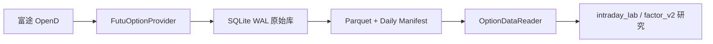

# market_data_hub

富途 OpenD 美股期权研究数据采集、治理与读取平台。

第一版只读采集 QQQ、TQQQ、MSTR、TSLA 的期权链和市场快照，服务于离线研究，不包含账户、持仓、模拟盘或下单接口。



## 快速开始

```bash
pip install -e '.[test]'
market-data doctor
market-data options collect-once --underlying US.QQQ --tier anchor
market-data options compact --trade-date 2026-08-03
market-data retention prune --days 7 --trash-days 3
pytest
```

默认数据目录为 `/Users/wutong/workspaces/py/market_data_hub_data`，可通过
`MARKET_DATA_HUB_DATA_DIR` 覆盖。完整服务由 `market-data options run` 驱动，建议经过
单次采集和一个 shadow session 验证后再安装 `ops/launchd/com.wutong.market-data-hub.plist`。

所有时间在存储层统一为 UTC；交易日期按 `America/New_York` 计算。IV 使用小数表示，例如
`0.90` 表示 90%。

Hot 层会把配置中的标的按不超过 400 个代码合并请求，再拆分为各标的逻辑快照；Surface/Anchor
按 API 批次让出调度权，Hot 拥有优先限速额度。每日 compaction 通过后自动执行 Raw 生命周期治理。

Raw SQLite 默认保留 1 天，随后移动到 `trash` 保留 3 天；Parquet 和 manifest 长期保留。清理前必须
通过 Raw/manifest 行数、状态和 Parquet SHA256 对账，对账不通过则保留 Raw（压缩失败或尚未压缩的
交易日不会被清理）。Raw 仅作为压缩缓冲区，内容与 Curated 逐行逐字段等价、不提供额外信息，因此
保留期可以很短。需要复核一致性时运行 `python ops/verify_raw_vs_curated.py`：它按 manifest 读取
Curated（与 Reader 路径一致）做全量逐字段比对，并报告未被 manifest 引用的孤儿 Parquet。Reader 的
时间查询默认按 `scheduled_at_utc`，需要分析网络延迟时显式传入 `time_basis="received"`。
